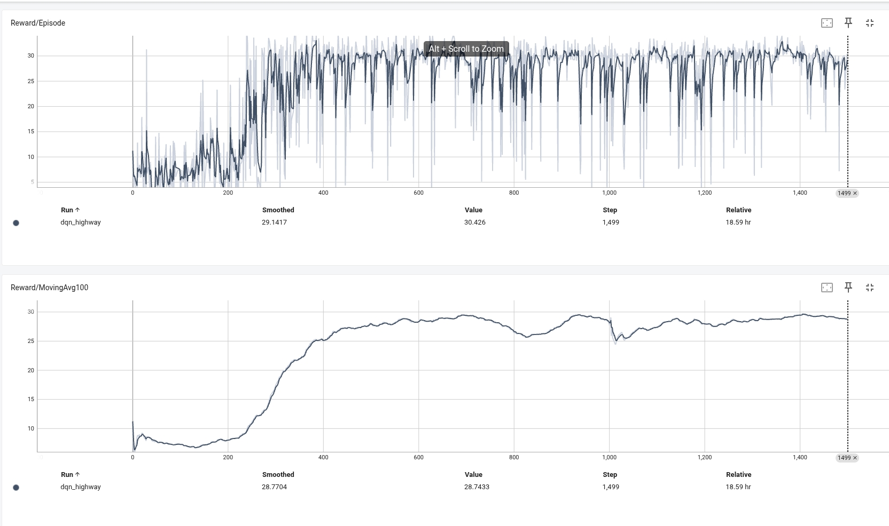
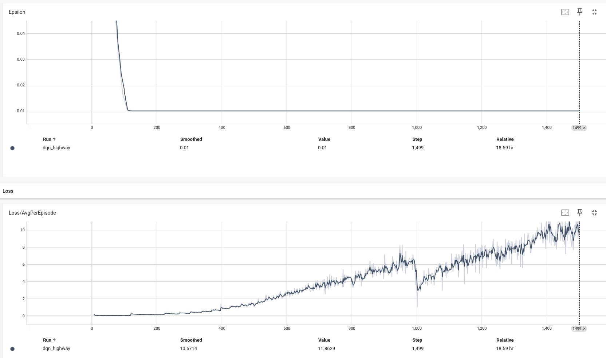
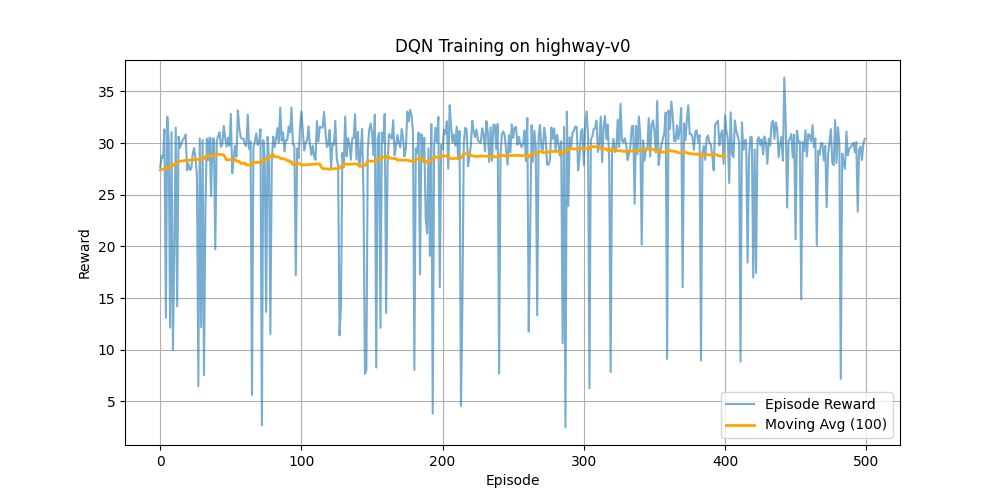

# DQN Highway Driving

   

Deep Q-Network (DQN) agent trained to drive safely on the Highway-Env environment.

## Features

- Standard DQN with target network & experience replay
- ε-greedy exploration with decay
- Periodic model checkpointing + best-model saving
- TensorBoard logging
- Simple evaluation script

## Requirements

```text
Python 3.10
torch
gymnasium
highway-env
numpy
matplotlib
```

## Installation

```bash
conda create -n highway-dqn python=3.10 -y
conda activate highway-dqn

pip install torch gymnasium highway-env numpy matplotlib
```

## Project Structure

```
.
├── dqn_agent.py        # Agent logic & training loop
├── QNetwork.py         # Neural network architecture
├── replay_buffer.py    # Prioritized or standard replay buffer
├── train.py            # Training script
├── test.py             # Evaluation script
├── models/             # Saved checkpoints
└── runs/               # TensorBoard logs
```

## Quick Start

### Train

```bash
python train.py
```

Default: 500 episodes (configurable), saves model every 100 episodes + best model

### Evaluate

```bash
python test.py
```

Runs 10 deterministic episodes and reports average reward + success rate

### View Training Curves

```bash
tensorboard --logdir runs
```

Open the displayed URL in your browser.

## Results

After sufficient training, the agent achieves **average episode reward ≈ 28–30** on `highway-v0`.

Example training curves:


<p align="center">
  
  
</p>

<p align="center">
  
</p>

## Saved Models

Located in `models/`

- `best_dqn_highway.pth` — highest validation performance
- `latest_dqn_highway.pth` — most recent checkpoint
- `dqn_highway_epXXXX.pth` — periodic snapshots

## Tips

- Training benefits greatly from GPU acceleration
- You can tune hyperparameters directly in `train.py`
- For better performance try: Double DQN, Dueling DQN, prioritized replay, etc.

## References

- [Highway-Env](https://github.com/Farama-Foundation/HighwayEnv)
- [Gymnasium Documentation](https://gymnasium.farama.org/)

---

Enjoy safer (and hopefully faster) highway driving! 🚗💨
```

